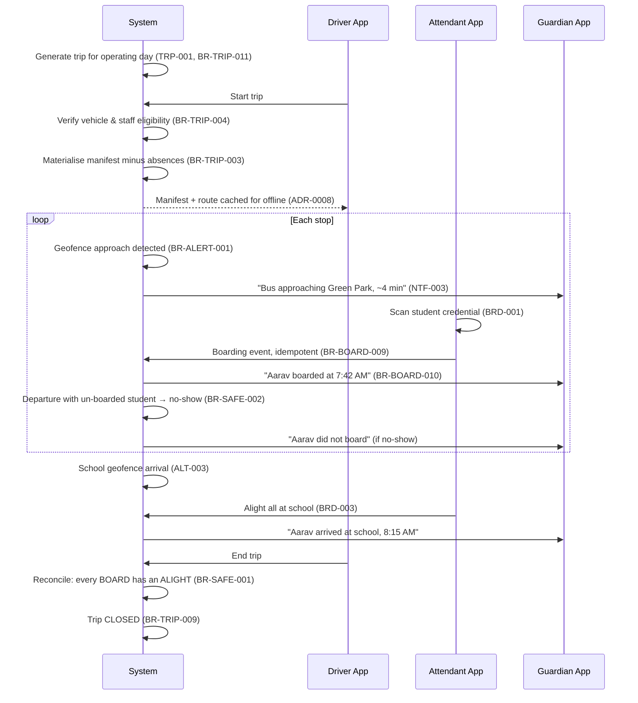
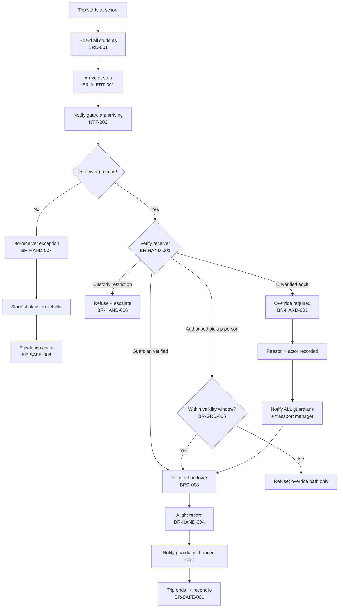

# USER JOURNEYS

**Document tier:** 1 — Product Discovery
**Status:** Active

End-to-end flows across modules. Each step names the business rules it enforces. These journeys are the source for the end-to-end tests in [`TEST_STRATEGY.md`](../07-testing/TEST_STRATEGY.md).

---

## J1 — Morning Pickup (Happy Path)

**Actors:** Attendant, Driver, Guardian, System



**Failure branches**

| Condition | Behaviour |
|---|---|
| Vehicle document expired | Trip start refused (BR-FLEET-002) |
| Driver licence expired | Trip start refused (BR-STAFF-001) |
| Trip not started within window | Delay alert to manager and guardians (BR-TRIP-010) |
| Network lost mid-route | Events queue locally, sync later (BR-SAFE-005) |
| Student not on manifest scanned | Blocked pending override (BR-BOARD-003); wrong-vehicle check (BR-SAFE-003) |

---

## J2 — Afternoon Drop with Guardian Handover

**The most safety-critical journey in the platform.**



**Why the no-receiver branch matters.** `BR-HAND-007` states the student is never released to no one. The vehicle retains the child and escalates. This is the rule most likely to be argued away for operational convenience — it is marked 🔴 for that reason.

---

## J3 — Left-Behind Detection

**The control that justifies the platform's existence.**

```
Trip reaches COMPLETED
        ▼
Reconciliation runs (BRD-013)
        ▼
For each manifest student:
   BOARD present, ALIGHT absent?  ──► UNACCOUNTED CHILD
        ▼
CRITICAL alert (BR-SAFE-001), within the configured detection window:
   → Driver + Attendant   (check the vehicle NOW)
   → Transport Manager
   → Student's guardians
        ▼
Trip CANNOT reach CLOSED (BR-TRIP-009)
        ▼
Each case resolved with explicit outcome + actor:
   • Found on vehicle          → alight recorded, incident raised
   • Alighted, record missed   → compensating record (BR-BOARD-001)
   • Never boarded             → correction + no-show
        ▼
Trip CLOSED
```

Alerts ignore quiet hours and notification preferences (BR-NTF-006) and escalate until acknowledged (BR-SAFE-006).

---

## J4 — SOS Escalation

```
Driver/Attendant presses SOS (INC-001)
        ▼
Recorded: actor, trip, live position, time (BR-INC-002) — cannot be deleted
        ▼
Immediate dispatch, bypassing ALL preferences and quiet hours (BR-SAFE-004)
        ▼
Level 1: Transport Manager        ──unacknowledged after window──┐
Level 2: School Admin + Principal ──unacknowledged after window──┤ (BR-SAFE-006)
Level 3: Configured emergency contacts ◄─────────────────────────┘
        ▼
Acknowledged → resolution required before closure (BR-INC-005)
False alarm → resolved as false alarm, NOT deleted (BR-INC-006)
```

Guardians on the affected trip are notified according to severity (BR-INC-004) — **without disclosing other students' identities** (BR-NTF-007).

---

## J5 — Absence Declaration

```
Guardian declares absence (ABS-001, BR-ABS-001)
        ▼
   Before trip start?
        ├─ Yes → Student excluded from materialised manifest (BR-ABS-002)
        │        No-show alerts suppressed (BR-ABS-005)
        │        Guardian may cancel until trip start (BR-ABS-004)
        │
        └─ No  → Manifest is immutable (BR-TRIP-003)
                 Recorded as manifest amendment (BR-ABS-003)
                 Trip staff notified
        ▼
If an "absent" student boards anyway:
   Alert raised, absence removed, BOTH facts recorded (BR-BOARD-007)
```

---

## J6 — Route Deviation

```
Position ingested (TRK-001) → validated (BR-TRACK-004)
        ▼
Corridor distance from route path exceeded, sustained beyond
configured duration (BR-ALERT-002)
        ▼
Single open alert — continuing condition does not stream (BR-ALERT-005)
        ▼
Transport Manager notified; guardian notification by severity policy
        ▼
Manager acknowledges with an outcome (BR-ALERT-006):
   diversion / traffic / breakdown → incident (INC-004) / false positive
```

Thresholds are tenant configuration (ADR-0007), bounded by platform floors (BR-CFG-003).

---

## J7 — Student Onboarding

**Actor:** School Admin

```
Import students from spreadsheet (STU-002)
        ▼
Per-row validation; errors reported per row, not wholesale — the file
is not rejected as a unit (see Fatima, PERSONAS.md)
        ▼
Guardian records created/linked with EXPLICIT rights (BR-GRD-001)
        ▼
At least one guardian holds "authorise handover" (BR-GRD-002)  ── else blocked
        ▼
Student assigned to pickup + drop stops per direction (BR-ROUTE-004)
        ▼
Assignment requires ≥1 active guardian (BR-STU-002) and active enrolment (BR-STU-004)
        ▼
Boarding credential issued (STU-007)
        ▼
Guardian invited; sets notification preferences (GRD-007, NTF-007)
```

---

## J8 — Vehicle Compliance Blocking

```
Vehicle document approaching expiry
        ▼
Escalating advance warnings at configured intervals (BR-FLEET-003)
        ▼
Expiry reached
        ▼
Vehicle blocked from NEW trip assignment (BR-FLEET-002)
        ▼
Trip already in progress continues — safety recording is never
interrupted mid-journey (cf. BR-TEN-006)
        ▼
Manager reassigns vehicle or renews document
```

The same pattern governs staff credentials (BR-STAFF-003).
