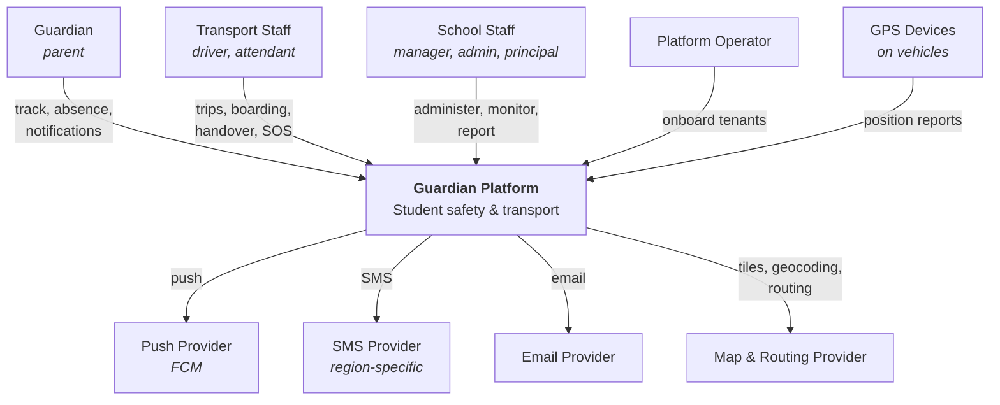
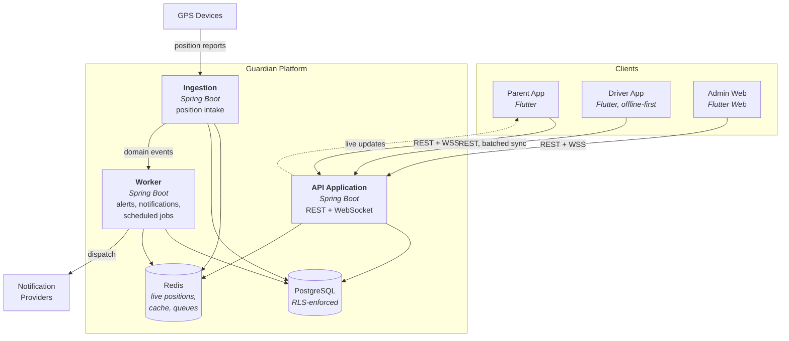
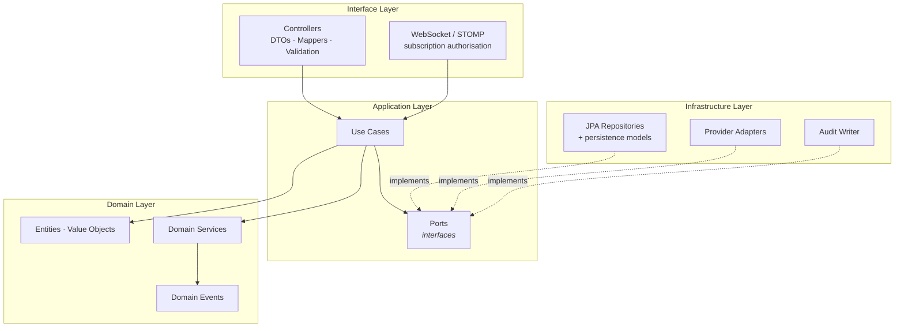

# ARCHITECTURE OVERVIEW

**Document tier:** 2 — System Design
**Status:** Active
**Implements:** [`ENGINEERING_PRINCIPLES.md`](../ENGINEERING_PRINCIPLES.md), ADR-0001, ADR-0003, ADR-0004, ADR-0006

---

## C4 Level 1 — System Context



All external providers sit behind ports (ADR-0005, ADR-0004). None is named in domain or application code.

---

## C4 Level 2 — Containers



### Why three deployables and not one

| Container | Reason for separation |
|---|---|
| **API** | Latency-sensitive, user-facing, scales with concurrent users. |
| **Ingestion** | Bursty machine traffic at fixed peaks. Isolating it means a device storm cannot degrade the parent app, and it scales on a different signal. |
| **Worker** | Long-running and retry-heavy. A slow notification provider must never occupy a request thread. |

All three build from the same Gradle modules and share the domain. This is **modular monolith deployed as three roles**, not microservices — the modules share a database and a transaction boundary, which is what keeps `BR-AUD-002` (audit in the same transaction) achievable.

---

## C4 Level 3 — Inside the API Application



**Dependencies point inward.** Infrastructure implements ports defined by the application; the domain knows about neither. Enforced by ArchUnit — see [`ARCHITECTURE_ENFORCEMENT.md`](../06-development/ARCHITECTURE_ENFORCEMENT.md).

---

## Request Lifecycle

```
HTTP request
   ▼
1  Authentication filter      validate JWT, load session          ADR-0006
   ▼
2  Tenant context filter      set app.tenant_id for the txn       ADR-0001
   ▼
3  Authorization              permission + scope, resolved live   BR-IAM-004
   ▼
4  Controller                 validate DTO, map to command
   ▼
5  Use case                   orchestrate, open transaction
   ▼
6  Domain                     enforce business rules
   ▼
7  Repository                 persist — RLS applies
   ▼
8  Audit                      same transaction                    BR-AUD-002
   ▼
9  Domain events              published after commit
   ▼
   Response DTO
```

Steps 1–3 are infrastructure and run for every request. **A developer cannot forget them** — that is the point of putting tenant scoping in a filter rather than in each query.

---

## Domain Events

Modules communicate upward and laterally by events, never by synchronous calls ([`MODULE_MAP.md`](../01-product-discovery/MODULE_MAP.md) cross-module rule 3).

```
StudentBoarded ──┬──► Notification (NTF-BOARD-01)
                 ├──► Wrong-vehicle check (BR-SAFE-003)
                 └──► Audit

TripCompleted ───┬──► Reconciliation (BR-SAFE-001)
                 └──► Audit

PositionReceived ┬──► Geofence evaluation (BR-ALERT-001)
                 ├──► Deviation / overspeed (BR-ALERT-002/003)
                 └──► ETA recalculation
```

Events are published **after commit** so a consumer never observes state the transaction later rolls back. Delivery to the worker is via a durable queue; handlers are idempotent.

---

## Data Stores

| Store | Holds | Loss impact |
|---|---|---|
| PostgreSQL | All durable state, including position history | Total — this is the system of record |
| Redis: live position | Latest position per vehicle | Live tracking degrades; **no data lost** (ADR-0004) |
| Redis: permission cache | Short-TTL resolved permissions | Latency only |
| Redis: queues | Pending notification and event work | Delayed delivery; queues are persisted |
| Device local store | Offline safety events | **Unacceptable** — encrypted, durable, survives reboot (ADR-0008) |

---

## Scaling Profile

Load is **bimodal**, not steady: two sharp peaks per school day, near-zero between.

| Component | Scales on | Bottleneck |
|---|---|---|
| API | Concurrent users (peaks at drop-off) | Database connections |
| Ingestion | Active vehicles × report rate | Write throughput; batched |
| Worker | Notification volume | Provider rate limits |
| PostgreSQL | Total data; position history dominates | Mitigated by daily partitioning |
| Redis | Active vehicles | Memory; live positions carry a TTL |

Detail in [`SCALABILITY.md`](SCALABILITY.md).

---

## Failure Behaviour

Ranked by the charter's commitments — safety recording degrades last.

| Failure | Behaviour |
|---|---|
| Redis unavailable | Live tracking stale; ingestion and persistence unaffected; **boarding unaffected** |
| Notification provider down | Retry with backoff; fallback channel for `CRITICAL` (BR-NTF-006) |
| Ingestion down | Positions lost for the outage; **boarding and handover unaffected** |
| Worker down | Alerts and notifications delayed, queued not lost |
| Network lost on vehicle | Driver app records locally and syncs later (ADR-0008) |
| PostgreSQL down | Platform unavailable; driver app **continues recording offline** |

The last row is the important one: the failure that takes down everything else still does not stop a child's boarding from being recorded.
