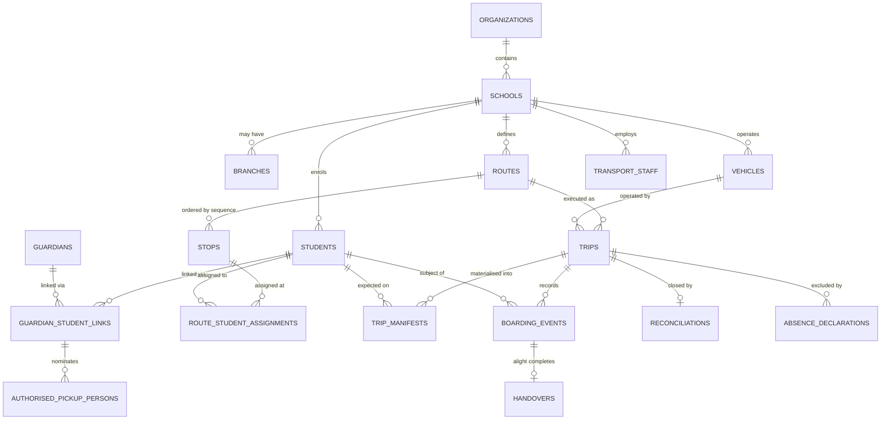

# DATA MODEL OVERVIEW

**Document tier:** 3 — Database
**Status:** Active
**Conventions:** [`CONVENTIONS.md`](CONVENTIONS.md) — standard columns, types, and RLS are defined there and not repeated per table.

---

## Shape of the Model

Three groups of data with different characteristics, different retention, and different guarantees:

| Group | Character | Volume | Mutability |
|---|---|---|---|
| **Configuration** | Organizations, schools, students, guardians, vehicles, staff, routes | Low, slow-changing | Mutable, soft-deleted, versioned |
| **Operational** | Trips, manifests, assignments, alerts | Moderate, daily churn | Mutable within a lifecycle |
| **Evidentiary** | Boarding events, handovers, SOS, audit | High, append-only | **Immutable** |

The distinction drives everything: evidentiary tables have no update path and no delete path (BR-BOARD-001, BR-AUD-001), while configuration tables carry full soft-delete and optimistic locking.

A fourth group, **telemetry** (`position_history`), is high-volume, append-only, and partitioned for retention by partition drop.

---

## Table Inventory

### MOD-01 Tenancy
`organizations` · `schools` · `branches` · `school_calendars`

### MOD-02 Identity & Access
`users` · `user_credentials` · `sessions` · `roles` · `permissions` · `role_permissions` · `user_roles` · `user_scopes`

### MOD-03 Student Registry
`students` · `student_classes` · `student_credentials`

### MOD-04 Guardian Management
`guardians` · `guardian_student_links` · `authorised_pickup_persons` · `custody_restrictions`

### MOD-05 Fleet
`vehicles` · `vehicle_documents` · `devices`

### MOD-06 Transport Staff
`transport_staff` · `staff_credentials` · `duty_assignments`

### MOD-07 Routes & Stops
`routes` · `stops` · `route_student_assignments`

### MOD-08 Trip Execution
`trips` · `trip_manifests` · `trip_manifest_amendments` · `trip_staff`

### MOD-09 Boarding & Attendance 🔒
`boarding_events` · `handovers` · `reconciliations` · `reconciliation_items`

### MOD-10 Tracking
`position_history` *(partitioned)* · `trip_etas`

### MOD-11 Geofencing & Alerts
`alert_rules` · `alerts`

### MOD-12 Notification
`notification_templates` · `notification_preferences` · `notifications` · `notification_deliveries`

### MOD-13 Incident & Emergency 🔒
`sos_alerts` · `incidents` · `incident_escalations`

### MOD-14 Absence
`absence_declarations`

### MOD-16 Audit 🔒
`audit_records` · `data_access_records`

### MOD-17 Configuration
`region_profiles` · `configuration_definitions` · `configuration_values` · `reference_data` · `localisation_resources`

🔒 = append-only, enforced by grants and triggers ([`CONVENTIONS.md`](CONVENTIONS.md)).

MOD-15 Reporting owns no tables — it reads across modules through their application layers.

---

## Core Relationships

Full diagram: [`ERD.md`](ERD.md).

---

## Design Decisions Worth Stating

### The manifest is materialised, not derived
`trip_manifests` is written at trip start from route assignments minus absences, and is thereafter immutable (BR-TRIP-003).

**Why not derive it on read?** Because route assignments change. A trip that ran three months ago must show who was *expected on it that day*, not who is assigned to that route today. Deriving it would silently rewrite history — unacceptable in a system whose records are evidence.

Later changes append to `trip_manifest_amendments` with actor and reason.

### Boarding events are append-only, and corrections are new rows
`boarding_events` has no update path (BR-BOARD-001). A correction inserts a new row with `corrects_event_id` pointing at the original, plus actor and reason. The original stays visible.

**Why:** an attendant who mis-scans and fixes it produces two records, both true — one about the child, one about the correction. Overwriting would destroy the second fact.

### Handover references the alight event, not the student
`handovers.boarding_event_id` is `NOT NULL` (BR-HAND-004). A handover cannot exist without the alight record it completes. The database enforces the ordering the business rule describes.

### Reconciliation blocks trip closure structurally
`trips.status` cannot reach `CLOSED` while any `reconciliation_items` row is unresolved (BR-TRIP-009, BR-SAFE-001). Enforced by a check in the domain **and** a constraint — the single most safety-critical invariant in the schema deserves both.

### Guardian rights are explicit columns, not inferred from relationship type
`guardian_student_links` carries `can_view`, `can_receive_notifications`, `can_authorise_handover`, `can_declare_absence` (BR-GRD-001).

**Why not infer from "mother"/"father"/"uncle"?** Because relationship type does not determine authority — custody arrangements, and the specific case of a restricted parent (BR-GRD-008), make inference dangerous. Rights are granted, never assumed.

### Position history is separate and partitioned
It is 99% of row volume and 0% of business logic. Partitioned by day so retention is a partition drop (BR-TRACK-007), and so its size never affects operational queries.

---

## Cardinality Notes

| Relationship | Cardinality | Rule |
|---|---|---|
| Student → Guardians | 1..* | At least one; ≥1 with handover right (BR-GRD-002) |
| Student → Route assignment | 0..1 per direction | Pickup and drop may differ (BR-ROUTE-004) |
| Student → Routes | May differ by direction | (BR-ROUTE-005) |
| Route → Stops | 2..* | Ordered, strictly increasing times (BR-ROUTE-001, BR-ROUTE-008) |
| Trip → Vehicle | 1 | One active trip per vehicle (BR-TRIP-005) |
| Trip → Driver | 1 | One active trip per driver (BR-STAFF-004) |
| Vehicle → Device | 0..1 active | (BR-FLEET-004) |
| Boarding event → Handover | 0..1 | Only alight events on DROP trips |

---

## Volume Projections at Reference Scale

200,000 students, 3,000 vehicles ([`SCALABILITY.md`](SCALABILITY.md)):

| Table | Rows/day | Rows/year |
|---|---|---|
| `position_history` | ~17M | ~3.2B *(partitioned, retention-bounded)* |
| `boarding_events` | ~800K | ~150M |
| `notifications` | ~800K | ~150M |
| `trips` | ~6K | ~1.1M |
| `audit_records` | ~1M | ~190M |

Excluding `position_history`, the operational dataset is well within a single PostgreSQL primary. That table is the only one whose growth requires structural management, which is exactly why it is the only one partitioned.
