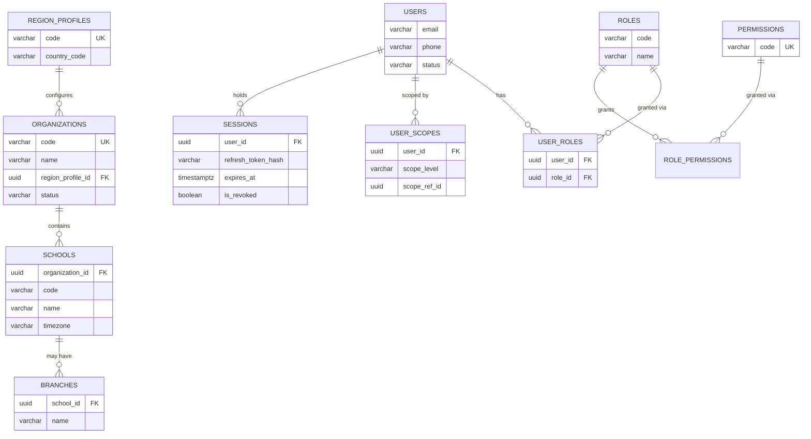
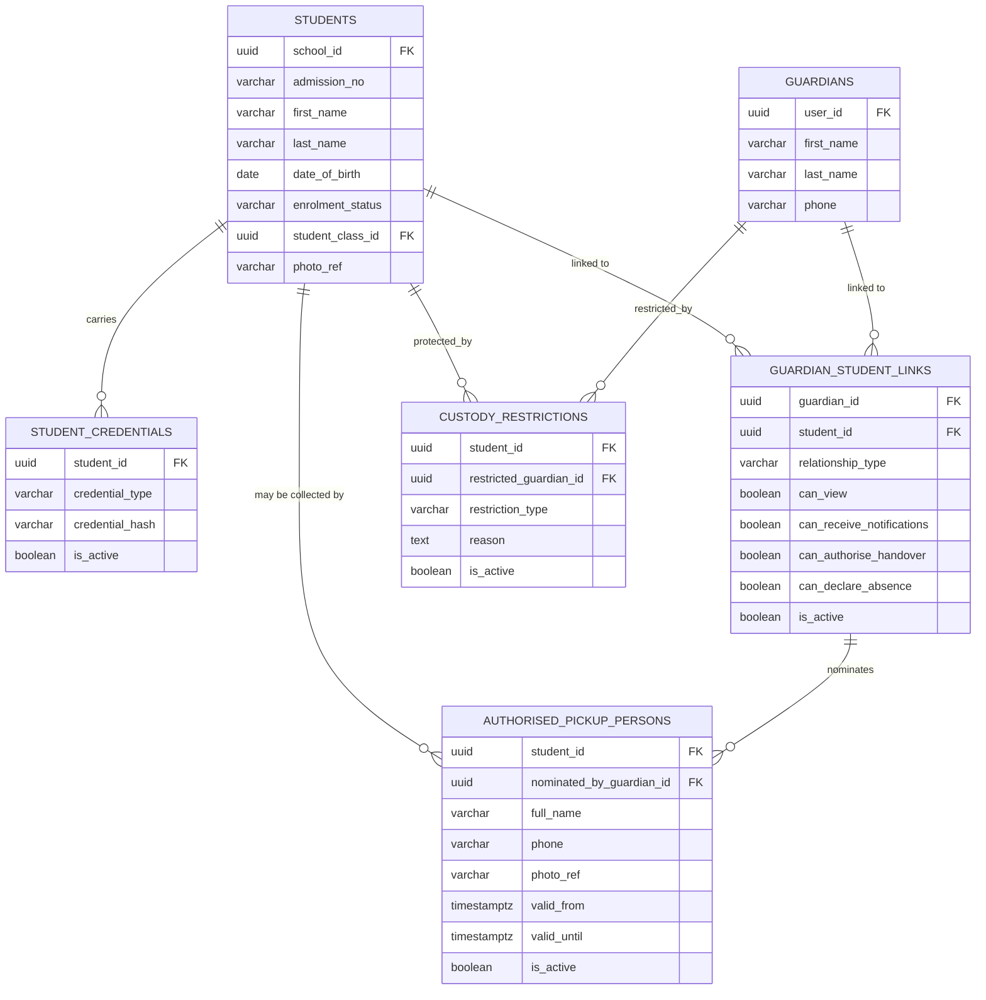
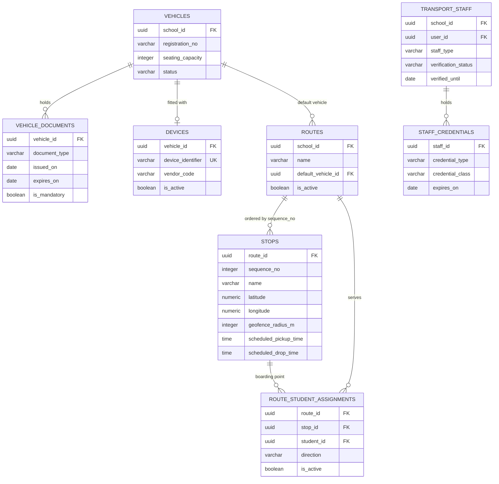
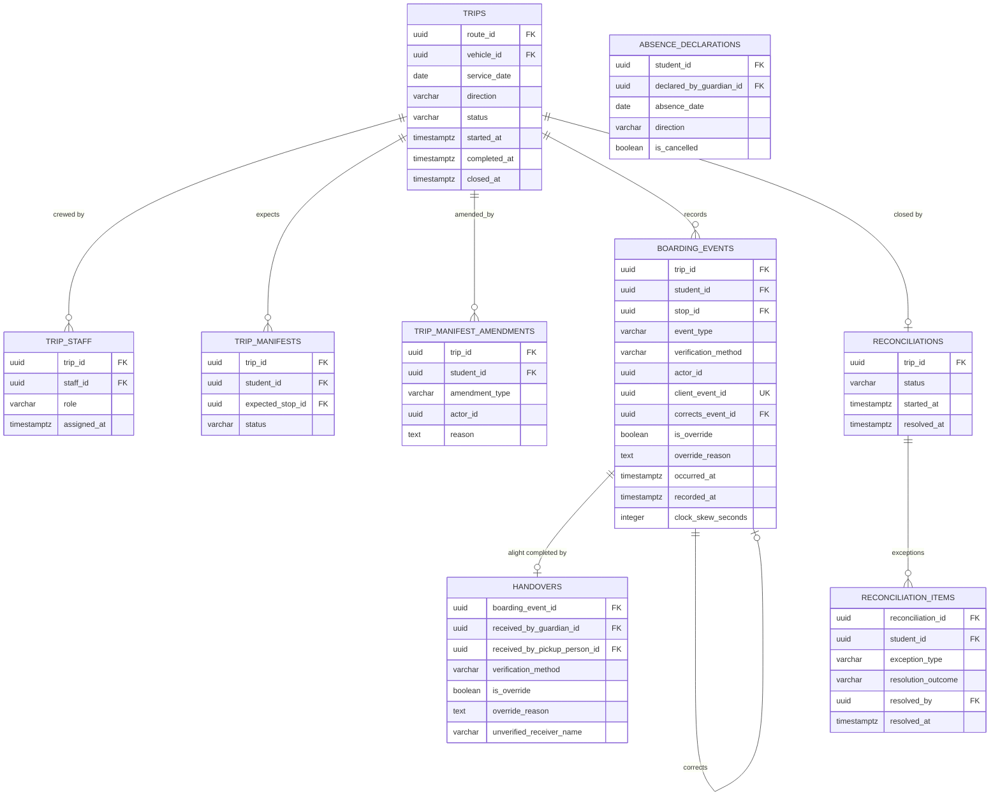
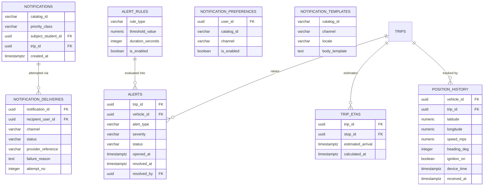
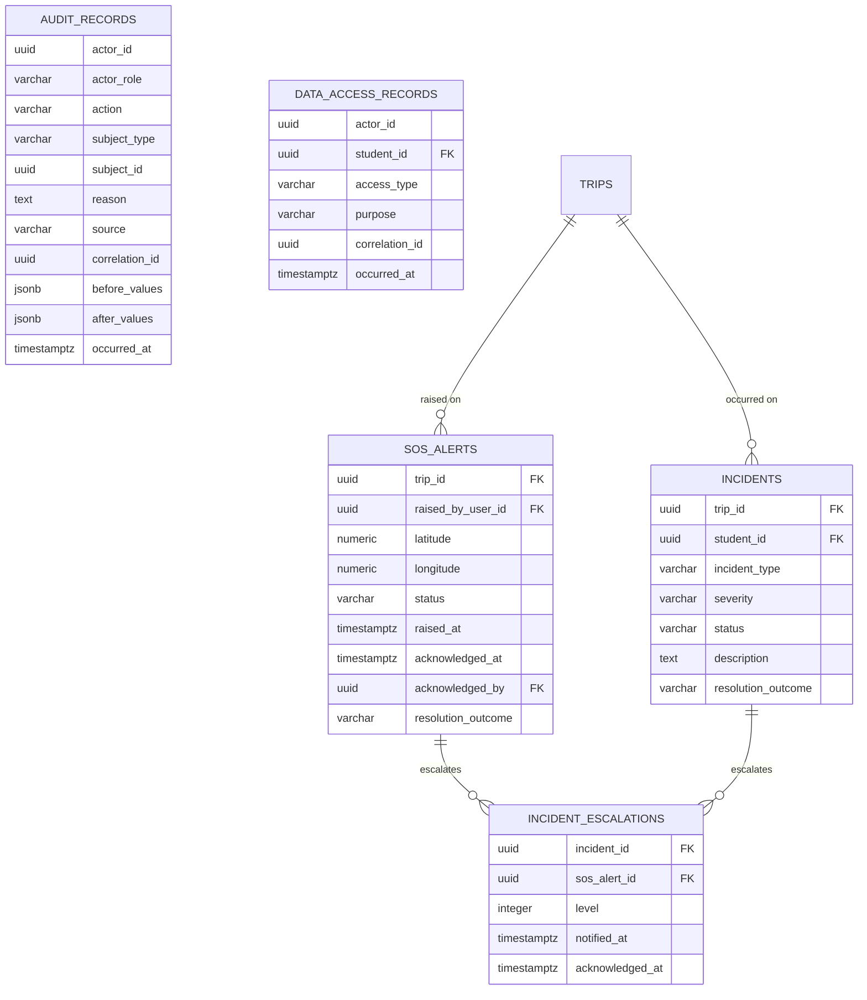

# ENTITY RELATIONSHIP DIAGRAM

**Document tier:** 3 — Database
**Status:** Active

Diagrams show key columns only. Standard columns (`id`, `tenant_id`, audit columns, `version`) are omitted — see [`CONVENTIONS.md`](CONVENTIONS.md). Full specifications in [`tables/`](tables/).

---

## Tenancy, Identity, Configuration

`permissions` is platform reference data — no `tenant_id`, no RLS. Tenants assign permissions to roles; they cannot invent permissions ([`PERMISSION_MATRIX.md`](../01-product-discovery/PERMISSION_MATRIX.md)).

---

## Students and Guardians

**The four boolean rights columns are the design point** (BR-GRD-001). `relationship_type` is descriptive; the booleans are authoritative. `custody_restrictions` overrides them entirely (BR-GRD-008, BR-HAND-006).

---

## Fleet, Staff, Routes

`document_type` and `credential_type` values come from the region profile (ADR-0007) — they are reference data, not an enum in code.

---

## Trips and Safety Events

The evidentiary core of the platform.

Structural safety properties visible in this diagram:

- `boarding_events.client_event_id` is unique — idempotent offline sync (BR-BOARD-009, ADR-0008).
- `boarding_events.corrects_event_id` self-references — corrections append, never overwrite (BR-BOARD-001).
- `handovers.boarding_event_id` is `NOT NULL` — no handover without an alight record (BR-HAND-004).
- `handovers` has both a guardian and a pickup-person FK, exactly one of which is set unless `is_override` is true (BR-HAND-001, BR-HAND-003).
- `reconciliation_items` gates `trips.status = CLOSED` (BR-SAFE-001, BR-TRIP-009).

---

## Tracking, Alerts, Notifications

`position_history` is partitioned by `received_at` (daily) — see [`INDEXING_AND_PARTITIONING.md`](INDEXING_AND_PARTITIONING.md).

`notification_deliveries` holds one row **per attempt**, not per notification — that is what makes "why was I not told?" answerable (BR-NTF-005).

---

## Incidents and Audit

`audit_records` and `data_access_records` deliberately carry **no foreign keys to the entities they describe** — a subject may be soft-deleted or archived while its audit trail must remain readable and intact. They store `subject_type` + `subject_id` instead (BR-AUD-001).
